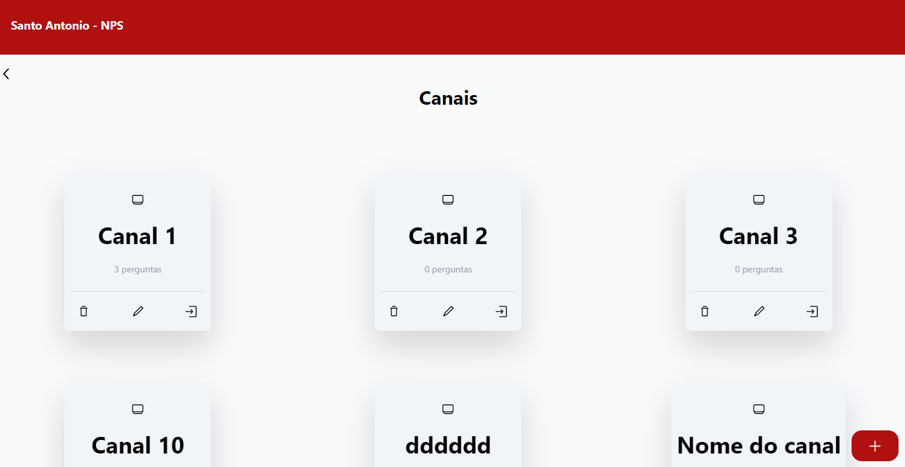

# Teste Loja Santo Antonio APP

<div align="center">
  
</div>

<br>

## Descrição
Teste dado pela loja santo antonio com objetivo de fazer um NPS com canais, perguntas e respostas.
Link para o API do teste [S.Antonio-NPS-FE](https://github.com/Micalli/S.Antonio-NPS-API)

 ## Ferramentes do APP
  - TypeScript
  - React
  - Router
  - Tailwind
  - HTML
  - CSS
  - Vite
  - Radix

## Rodando a API
#### Clone
```bash
$ git clone https://github.com/Micalli/S.Antonio-NPS-API.git && S.Antonio-NPS-FE
```

#### Instalação da depedencias

```bash
$ yarn install
```
#### Rodando

```bash
# development
$ yarn dev
```
